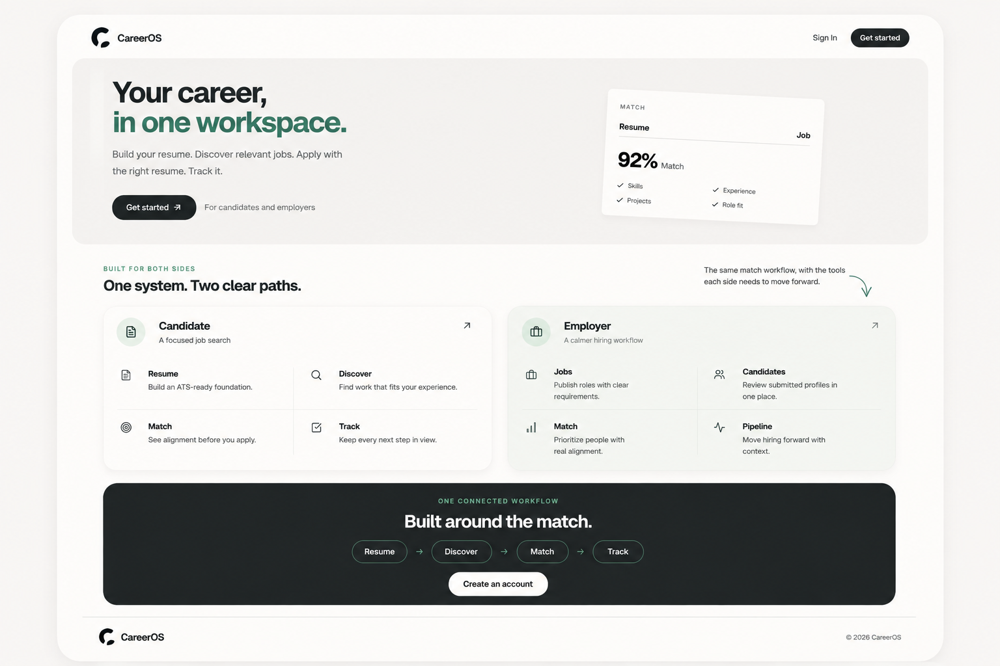
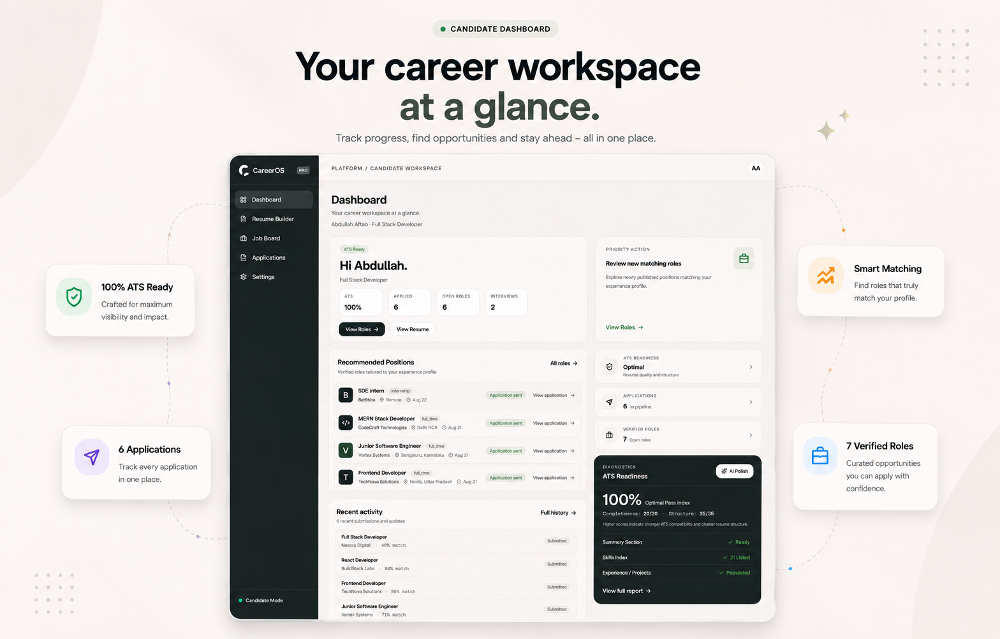
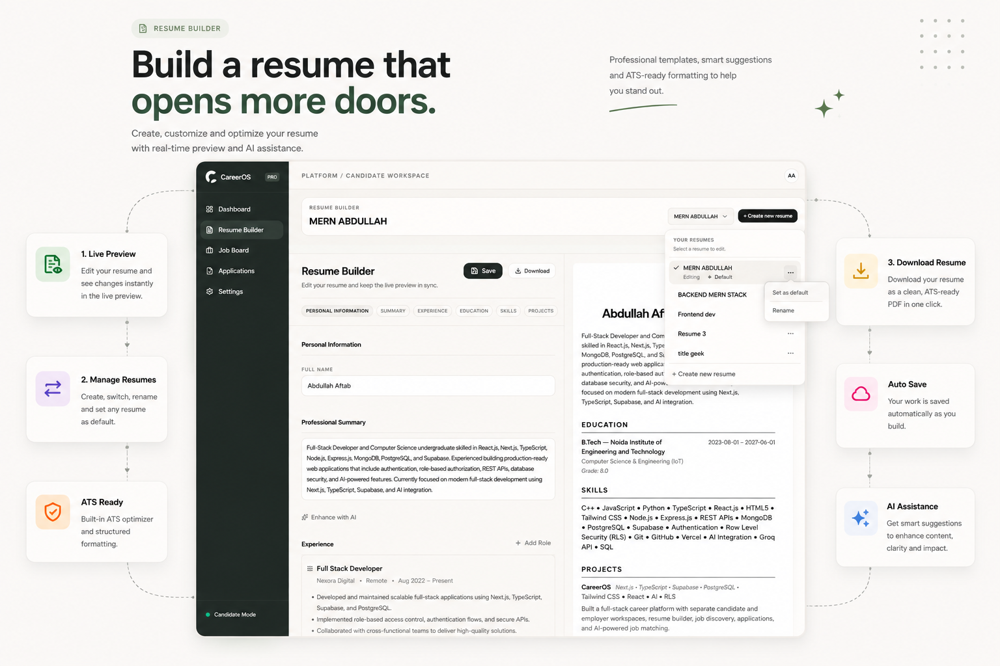
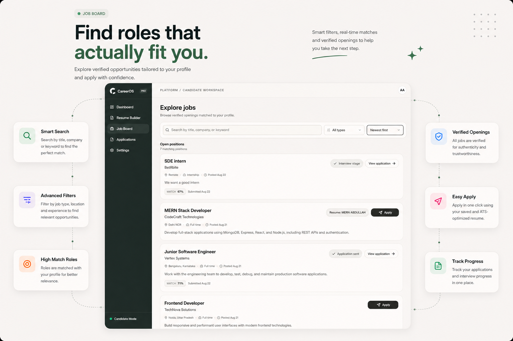
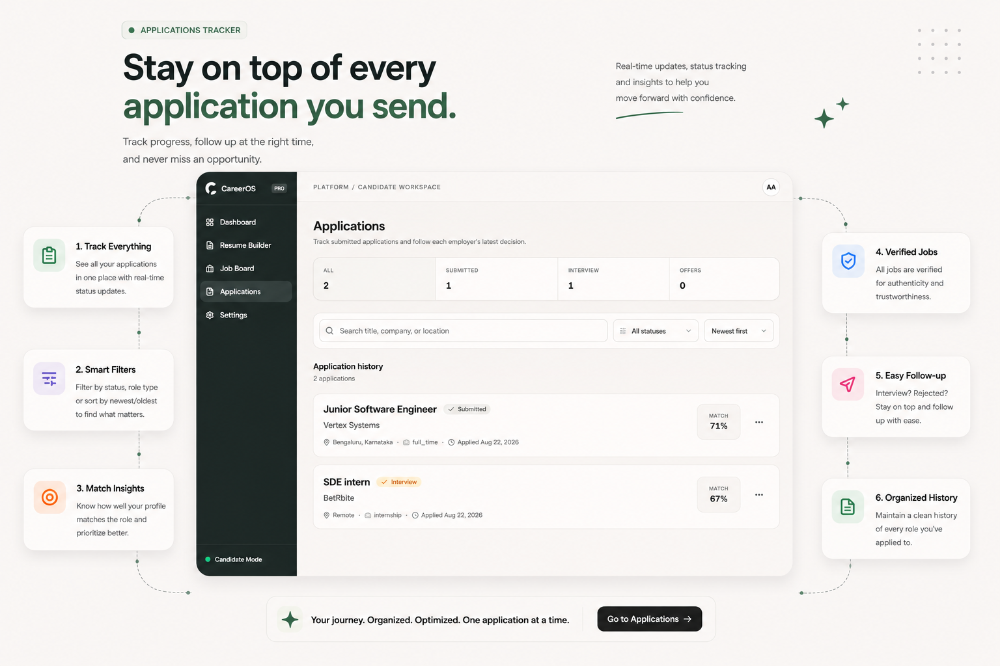
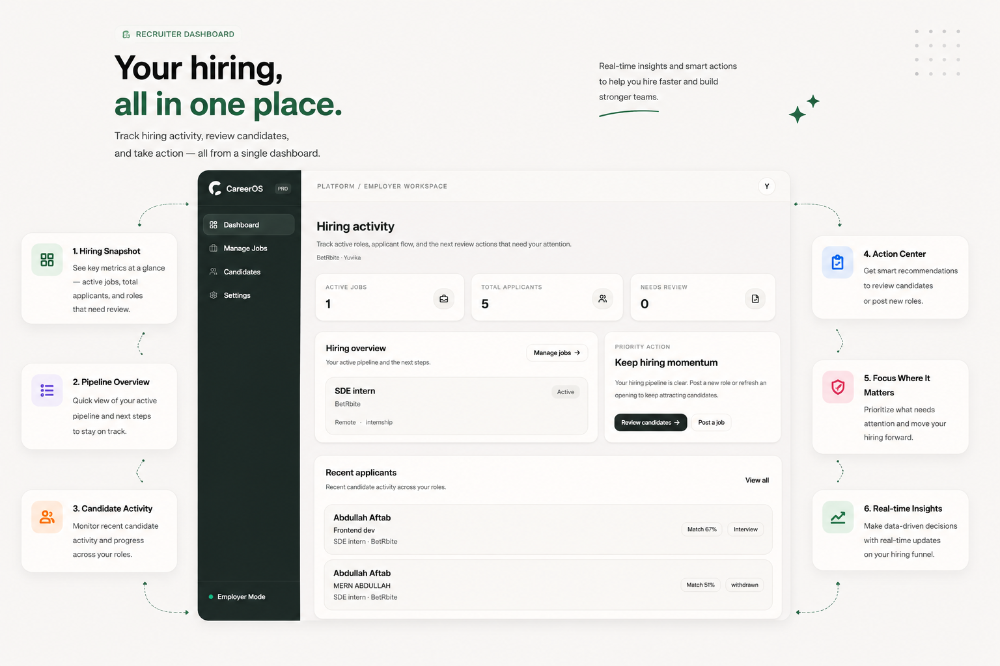

# CareerOS

CareerOS is a full-stack career platform that connects resume creation, job discovery, deterministic job matching, application tracking, and employer hiring workflows in one system.

[Live Demo](https://career-os-seven-neon.vercel.app/) · [GitHub Repository](https://github.com/Abdullah7-byte/CareerOS)



*CareerOS introduces the candidate and employer experiences from a single product entry point.*

## What is CareerOS?

CareerOS serves two sides of the hiring process. Candidates can move from building a resume to discovering relevant roles, applying with a selected resume, and tracking outcomes. Employers can publish and manage jobs, review applicants, and work through a hiring-oriented candidate workspace.

The product is designed as an end-to-end workflow rather than a disconnected collection of forms: **Resume → Jobs → Match → Apply → Track** for candidates, and **Jobs → Candidates → Match → Hiring Pipeline** for employers. Resume data, relevance scoring, applications, and employer review are linked through the application’s data model.

## Core Features

### Candidates

- Dashboard for career activity and application context
- Multiple-resume creation, editing, renaming, deletion, live preview, and PDF export
- AI-assisted resume enhancement and readiness-oriented evaluation
- Job discovery with a relevance indicator for the selected resume
- Resume-backed applications and application tracking
- Profile, account, and password management

### Employers

- Employer dashboard and hiring workspace
- Job posting, editing, deletion, and applicant counts
- Candidate and application review, including submitted resume access where authorized
- Employer account and organization settings

## AI & Job Matching

CareerOS uses AI selectively for resume-related assistance and evaluation; it is not the authority for every product decision. AI responses are handled as structured data at the application boundary so resume workflows can use them safely.

Job relevance is separate from that AI assistance. The final match is calculated by a deterministic 25-point scoring model with defined category weights, then presented as a percentage for readability. That makes matching behavior inspectable and consistent rather than delegating the final score to an LLM.

## Technical Architecture

CareerOS is built with the Next.js App Router, React, TypeScript, and Tailwind CSS. Server Components load protected dashboard data, while client components handle interactive resume, settings, and hiring workflows. Server Actions perform application mutations and return typed success/error results; Route Handlers cover HTTP-oriented flows such as password updates.

Supabase provides authentication and the PostgreSQL data layer. The schema models profiles, resumes and their sections, jobs, and applications through relational foreign keys. Supabase clients are separated by server/client context, keeping authenticated database access and privileged operations on the server. Zod validates untrusted inputs at mutation boundaries, and PDF generation produces a downloadable representation of a resume.

## Security & Data Design

CareerOS separates candidate and employer roles and applies authorization at more than one layer. Supabase Auth establishes the active user; PostgreSQL Row Level Security restricts access to user-owned data; and server-side actions add ownership and role checks before performing sensitive work.

Migrations define RLS policies, role constraints, database relationships, and protections around the application lifecycle. Candidate resumes and related sections are ownership-scoped, job and application operations are checked against the relevant candidate or job owner, and externally supplied data is validated before database operations. This combination keeps candidate and employer data boundaries explicit rather than relying only on UI routing.

## Screenshots



*Candidate workspace with career and application context.*



*Resume editing with live preview and resume-assistance workflow.*



*Job discovery with relevance information for candidate decision-making.*



*Application workflow and tracking experience.*



*Employer workspace for managing hiring activity.*

## Tech Stack

| Area | Technology |
| --- | --- |
| Frontend | Next.js App Router, React, TypeScript, Tailwind CSS |
| Backend and data | Supabase, PostgreSQL, Server Actions, Route Handlers |
| Authentication and access | Supabase Auth, PostgreSQL RLS, role-based authorization |
| Validation | Zod |
| AI | Groq SDK integration for resume-related assistance |
| PDF | `@react-pdf/renderer` |
| Quality and deployment | ESLint, TypeScript checks, Git/GitHub, Vercel |

## Engineering Decisions

**Deterministic match scoring**
The final relevance score uses a defined 25-point model rather than an LLM-generated score. This keeps the candidate-facing result repeatable while leaving AI focused on resume assistance.

**Database-enforced access boundaries**
RLS policies, role separation, and ownership checks protect profiles, resumes, jobs, and applications close to the data. Server-side authorization complements those database controls for sensitive mutations.

**Structured resume and application data**
Resumes are modeled as a parent record with related experience, education, skills, and projects. Applications link the candidate, job, and selected resume, allowing the candidate and employer workflows to operate on the same hiring record.

**Validated server-side mutations**
Server Actions provide typed success/error results, and Zod validates boundary inputs before they reach database operations. This makes UI error handling explicit while keeping mutation logic out of the browser.

**Atomic database operations where consistency matters**
Database functions and constraints support operations such as selecting a default resume and protecting application/resume ownership relationships, reducing the chance of partially applied workflow changes.

## Getting Started

### Prerequisites

- Node.js 20+
- A Supabase project
- A Groq API key for AI-assisted resume features

### Installation

```bash
git clone https://github.com/Abdullah7-byte/CareerOS.git
cd CareerOS
npm install
```

Create a `.env.local` file with the required environment variables:

```bash
NEXT_PUBLIC_SUPABASE_URL=
NEXT_PUBLIC_SUPABASE_ANON_KEY=
GROQ_API_KEY=
```

Apply the Supabase migrations to the target project, then start the development server:

```bash
npm run dev
```

Run the available quality checks with `npm run lint` and `npx tsc --noEmit`.

## Project Status

CareerOS is an independently designed and implemented portfolio project demonstrating a complete candidate-to-employer hiring workflow, with ongoing room for iteration and expansion.

## Author

- GitHub: [Abdullah7-byte](https://github.com/Abdullah7-byte)
- LinkedIn: _Add LinkedIn URL_
